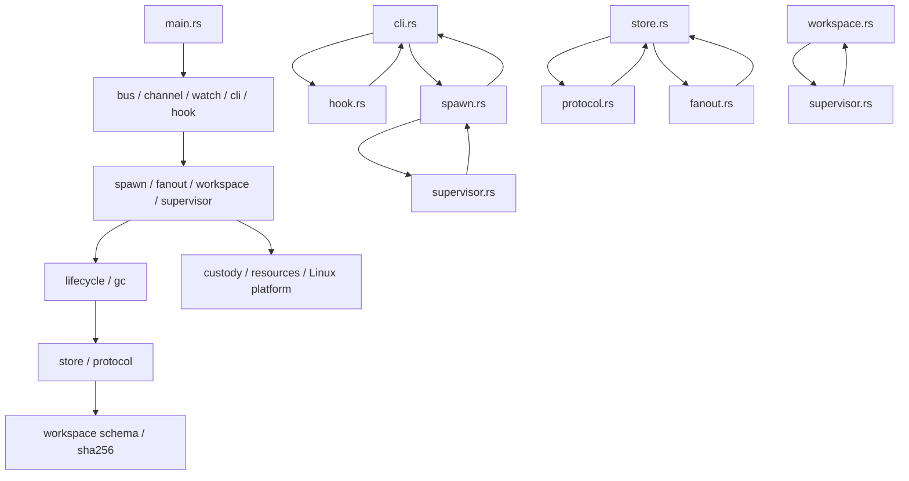

# Session Relay Rust crate map

This is a point-in-time reading map for the `relay` crate. Counts use this repository reader's one-based final-line convention, which includes the terminal empty line after a final newline; they are therefore one greater per file than `wc -l`. Every file-size aggregate below is the sum of the cited ranges. Re-check an anchor after editing the file above it.

## 1. Orientation

This crate is the local cross-session message bus and the authority that launches, supervises and isolates managed workers and Git workspaces (`src/store.rs:1-18`, `src/supervisor.rs:1-6`, `src/workspace.rs:35-37`). It builds one multi-call executable: `main` routes the first argument to an MCP bus, an experimental Claude channel, hooks, ordinary CLI verbs, mailbox watching, process spawning, fan-out, managed workspaces, and hidden supervisor helpers (`src/main.rs:1-75`). Four concepts make the rest of the crate readable:

1. **A session is durable identity, not a process.** The shared store maps a Claude/Codex session UUID to its directory, name, tool and server, and keeps per-session mailboxes and markers under one fixed home (`src/store.rs:1-18`, `src/store.rs:551-668`). A process may die while the session record, mailbox, lifecycle record or recovery evidence remains (`src/lifecycle.rs:1-7`, `src/lifecycle.rs:257-312`).
2. **There are three durable authorities.** The legacy registry/mailbox store owns discovery and delivery (`src/store.rs:1-18`); `lifecycle-v1.json` owns managed-worker bindings, operations, supervisors and watchdogs (`src/lifecycle.rs:28-38`, `src/lifecycle.rs:1171-1200`); workspace JCS records, journals and capabilities own repository mutation (`src/workspace/authority.rs:19-21`, `src/workspace/authority.rs:830-1090`, `src/workspace/schema.rs:21-128`). They compose, but one must not be treated as a cache of another.
3. **A managed workspace is more than a worktree.** It is a repository identity, a path-claim set, a worker capability, a lifetime lease, projected resources, a Git broker and a custody-owned process tree (`src/workspace/schema.rs:698-851`, `src/workspace/schema.rs:1547-1921`, `src/workspace.rs:1047-1559`). The nine public verbs advance or inspect that authority; workers do not receive direct coordinator authority (`src/workspace.rs:35-37`, `src/workspace.rs:152-279`).
4. **Custody advances on evidence.** On Linux, the worker is admitted to a cgroup, confined with Landlock, pinned by a pidfd, stopped at exec with `ptrace`, and controlled by two custodians exchanging authenticated packets and kernel FDs (`src/workspace/platform/linux.rs:56-61`, `src/workspace/platform/linux.rs:605-805`, `src/workspace/custody.rs:615-631`). Empty-process, activation, lease-close and crash evidence are persisted before later state becomes valid (`src/workspace/platform/linux.rs:170-200`, `src/workspace.rs:2927-3027`, `src/workspace.rs:5827-6181`). Writable custody is deliberately refused outside the admitted Linux backend (`src/workspace/platform.rs:5-34`, `src/workspace/platform/macos.rs:1-12`).

The source tree is 53,478 lines in 30 files. Inline `#[cfg(test)]` regions account for 4,853 lines; adding the 15,436 lines in `tests/` makes 20,289 of 68,914 lines test code (29.4%). The per-file ranges are enumerated below and in §5; representative inline-test boundaries include `src/workspace.rs:8694-9222`, `src/workspace/git.rs:3285-4252`, `src/workspace/schema.rs:3551-3870`, and `src/workspace/platform/linux.rs:2496-2944`.

## 2. Module map

`†` marks the four largest files. Together they contain 23,527 lines, 44.0% of `src/` (`src/workspace.rs:1-9223`, `src/lifecycle.rs:1-6182`, `src/workspace/git.rs:1-4252`, `src/workspace/schema.rs:1-3870`).

| File | Lines | Single responsibility / best first anchor |
|---|---:|---|
| `src/lib.rs` | 17 | Declares the crate's 16 top-level modules (`src/lib.rs:1-16`). |
| `src/main.rs` | 81 | Dispatches the multi-call binary and hidden helper entrypoints (`src/main.rs:18-75`). |
| `src/appserver.rs` | 1,367 | Implements the hand-written WebSocket/JSON-RPC Codex app-server client (`src/appserver.rs:1-20`, `src/appserver.rs:652-1199`). |
| `src/bus.rs` | 629 | Serves the MCP stdio bus and dispatches all bus tools (`src/bus.rs:12-18`, `src/bus.rs:269-504`). |
| `src/channel.rs` | 302 | Serves the experimental, session-bound Claude channel (`src/channel.rs:1-12`, `src/channel.rs:176-302`). |
| `src/cli.rs` | 1,484 | Parses shared CLI arguments and implements registry, mail, attach, wake and doctor commands (`src/cli.rs:21-30`, `src/cli.rs:755-1304`). |
| `src/discover.rs` | 280 | Scans Claude/Codex on-disk session stores without mutating them (`src/discover.rs:13-14`, `src/discover.rs:61-279`). |
| `src/fanout.rs` | 1,278 | Orchestrates bounded worktree reservation, handback, collect and abandoned-worktree reaping (`src/fanout.rs:13-24`, `src/fanout.rs:525-1125`). |
| `src/fanout/authority.rs` | 1,167 | Owns the locked `fanout-v1.json` record and its state transitions (`src/fanout/authority.rs:15-18`, `src/fanout/authority.rs:19-643`). |
| `src/fanout/git.rs` | 398 | Performs fan-out-specific repository identity, worktree, branch, merge and removal operations (`src/fanout/git.rs:1-7`, `src/fanout/git.rs:11-397`). |
| `src/gc.rs` | 311 | Orders lifecycle GC before legacy-store GC behind one preparation step (`src/gc.rs:5-10`, `src/gc.rs:11-106`). |
| `src/hook.rs` | 626 | Registers SessionStart/UserPromptSubmit identity and renders inbox mail as untrusted context (`src/hook.rs:15-25`, `src/hook.rs:195-455`). |
| `src/lifecycle.rs` † | 6,182 | Owns durable managed-worker state, admission, fencing, supervisor/watchdog state and lifecycle GC (`src/lifecycle.rs:1-7`, `src/lifecycle.rs:28-38`, `src/lifecycle.rs:1171-3889`). |
| `src/protocol.rs` | 1,945 | Owns typed request/reply/result records and the crash-safe pending/open/terminal claim store (`src/protocol.rs:1-7`, `src/protocol.rs:240-862`, `src/protocol.rs:1061-1945`). |
| `src/sha256.rs` | 241 | Provides dependency-free SHA-256, HMAC and constant-time equality (`src/sha256.rs:1-241`). |
| `src/spawn.rs` | 2,169 | Creates detached Claude/Codex workers, log pumps, app-server births and fan-out supervisors (`src/spawn.rs:21-32`, `src/spawn.rs:341-1869`). |
| `src/store.rs` | 1,986 | Owns the fixed relay home, registry, mailboxes, markers, watcher locks and legacy GC (`src/store.rs:1-18`, `src/store.rs:506-668`, `src/store.rs:1244-1761`). |
| `src/supervisor.rs` | 2,997 | Owns detached watchdog/supervisor processes, child stdio/reap, and the workspace custody bridge (`src/supervisor.rs:1-6`, `src/supervisor.rs:94-983`, `src/supervisor.rs:1244-2438`). |
| `src/watch.rs` | 796 | Watches mailboxes and chooses app-server push or wake fallback (`src/watch.rs:31-39`, `src/watch.rs:124-744`). |
| `src/workspace.rs` † | 9,223 | Orchestrates the nine workspace verbs, manifests, Git broker, custody processes, cleanup and recovery (`src/workspace.rs:35-43`, `src/workspace.rs:152-279`, `src/workspace.rs:704-8692`). |
| `src/workspace/authority.rs` | 1,635 | Owns authority roots, ranked locks, repository records, leases, journals and manifest CAS (`src/workspace/authority.rs:19-170`, `src/workspace/authority.rs:249-1346`). |
| `src/workspace/capability.rs` | 481 | Mints, authenticates and durably revokes coordinator/worker HMAC capabilities (`src/workspace/capability.rs:13-24`, `src/workspace/capability.rs:123-460`). |
| `src/workspace/custody.rs` | 2,278 | Implements authenticated guardian/supervisor control packets and FD transfer (`src/workspace/custody.rs:16-20`, `src/workspace/custody.rs:130-599`, `src/workspace/custody.rs:615-1922`). |
| `src/workspace/git.rs` † | 4,252 | Owns all workspace-side Git execution, preservation, ordered integration and cleanup proof (`src/workspace/git.rs:15-317`, `src/workspace/git.rs:319-3284`). |
| `src/workspace/platform.rs` | 35 | Selects the Linux custody backend or returns the platform refusal (`src/workspace/platform.rs:1-34`). |
| `src/workspace/platform/linux.rs` | 2,944 | Implements cgroup/pidfd process custody, runtime closure proof, Landlock and traced activation (`src/workspace/platform/linux.rs:17-61`, `src/workspace/platform/linux.rs:209-2495`). |
| `src/workspace/platform/macos.rs` | 12 | Defines the exact negative admission for writable macOS custody (`src/workspace/platform/macos.rs:1-12`). |
| `src/workspace/repository_gate.rs` | 835 | Serializes legacy/workspace admission and proves exact ext4 repository identity (`src/workspace/repository_gate.rs:14-16`, `src/workspace/repository_gate.rs:18-685`). |
| `src/workspace/resources.rs` | 3,657 | Allocates, receipts, reloads and releases session resources through verified providers (`src/workspace/resources.rs:25-30`, `src/workspace/resources.rs:32-3190`). |
| `src/workspace/schema.rs` † | 3,870 | Defines canonical JCS plus every closed workspace request, receipt, capability and state type (`src/workspace/schema.rs:9-128`, `src/workspace/schema.rs:395-3550`). |

The four giants are large for different reasons:

- **`workspace.rs` mixes at least seven change axes:** nine-verb CLI parsing (`src/workspace.rs:35`, `src/workspace.rs:152-326`); the manifest JCS record and mutation helper (`src/workspace.rs:328-629`); the five core lifecycle mutations—start, handback, integrate, finish and abort (`src/workspace.rs:783-1559`, `src/workspace.rs:1957-2002`, `src/workspace.rs:2613-2893`, `src/workspace.rs:4417-4658`); Git broker server and client (`src/workspace.rs:5319-5468`, `src/workspace.rs:7389-8631`); the Linux guardian (`src/workspace.rs:6184-6475`, `src/workspace.rs:6964-7216`); the custody supervisor process body (`src/workspace.rs:6642-6801`); and cleanup/crash reconciliation, including recover (`src/workspace.rs:2927-5192`).
- **`lifecycle.rs` mixes:** domain types (`src/lifecycle.rs:54-1169`); their JSON codecs (`src/lifecycle.rs:5031-5962`); transactional admission and attach (`src/lifecycle.rs:1200-2199`, `src/lifecycle.rs:4381-4804`); fencing/drain (`src/lifecycle.rs:2051-2199`, `src/lifecycle.rs:3904-4183`); lifecycle GC (`src/lifecycle.rs:2203-2810`); supervisor/watchdog and reap state (`src/lifecycle.rs:3120-3839`); and binding-lock helpers (`src/lifecycle.rs:4914-4961`, `src/lifecycle.rs:6133-6165`).
- **`workspace/git.rs` mixes:** fd-pinned Git invocation (`src/workspace/git.rs:15-310`); commit/artifact WIP preservation (`src/workspace/git.rs:319-1139`); a PAX/USTAR writer (`src/workspace/git.rs:929-1067`); worktree provisioning and WIP application (`src/workspace/git.rs:1245-1598`); ordered integration, rollback and patch-id proof (`src/workspace/git.rs:1600-2783`); and cleanup/retention proof (`src/workspace/git.rs:2785-3284`).
- **`workspace/schema.rs` is the cohesive giant:** a JCS implementation (`src/workspace/schema.rs:21-393`), validated primitive types (`src/workspace/schema.rs:395-696`), the workspace state graph (`src/workspace/schema.rs:594-668`), about twenty-five closed record codecs (`src/workspace/schema.rs:698-3550`), and cross-record semantic validation (`src/workspace/schema.rs:1028-1056`, `src/workspace/schema.rs:2242-2319`, `src/workspace/schema.rs:2656-2673`).

## 3. Layering and cycles

The arrows below are actual dependencies, not a claim that the layers are clean. Downward arrows are the useful reading order; every paired arrow is one of the six production file-to-file cycles.

The six cycles, with both edges exposed:

1. `cli.rs ↔ hook.rs`: CLI imports the hook, while the hook imports the shared CLI `Args` parser (`src/cli.rs:21-30`, `src/hook.rs:15-17`).
2. `cli.rs ↔ spawn.rs`: CLI dispatches spawn-related behavior, while spawn imports `cli::Args` (`src/cli.rs:28-30`, `src/spawn.rs:21-24`).
3. `spawn.rs ↔ supervisor.rs`: spawn calls child custody/observation, while supervisor imports `CHILD_ENV_ALLOWLIST` from spawn (`src/spawn.rs:294-296`, `src/spawn.rs:1392-1394`, `src/supervisor.rs:15-17`).
4. `store.rs ↔ protocol.rs`: mailbox rollback/drain calls `ProtocolStore`, while the protocol store uses store locking, names, time and atomic writes (`src/store.rs:1696-1737`, `src/protocol.rs:1-2`, `src/protocol.rs:1088-1153`).
5. `store.rs ↔ fanout.rs`: legacy GC calls the fan-out reaper, while fan-out uses the shared store (`src/store.rs:880-921`, `src/fanout.rs:13-15`).
6. `workspace.rs ↔ supervisor.rs`: workspace calls three custody protocol entrypoints and uses retained-fault types; supervisor imports workspace custody/Linux types and calls workspace mutation refusal (`src/workspace.rs:5827-5898`, `src/workspace.rs:6371-6374`, `src/workspace.rs:6754-6794`, `src/supervisor.rs:18-27`, `src/supervisor.rs:477-515`, `src/supervisor.rs:2081-2088`). This is the worst pair: eleven production reference sites split one guardian/supervisor protocol across 9,223- and 2,997-line files.

At subtree granularity there is an additional `workspace → fanout → workspace/*` loop: workspace constructs a `FanoutStore`, while fan-out imports workspace authority, repository-gate, schema and Git modules (`src/workspace.rs:1098-1100`, `src/fanout.rs:16-20`, `src/fanout/git.rs:1-4`). More broadly, twelve modules form one strongly connected component; the most surprising upward edges are legacy store GC calling fan-out and fan-out entrypoints calling the CLI parser (`src/store.rs:880-921`, `src/fanout.rs:1094-1125`).

## 4. Kernel-concept index

**Counting rule.** A call site is a syntactic production call expression under `src/`; inline `#[cfg(test)]` modules and `tests/` are excluded. When one helper funnels the mechanism, the table gives both raw kernel crossings and wrapper callers.

| Mechanism | What it buys | Primary production use | Call-site count |
|---|---|---|---:|
| cgroup v2 delegated leaf | A kernel-maintained set containing the worker and every descendant; teardown and emptiness do not require PID enumeration. | Opens pinned directory, `events`, `procs` and `kill` FDs after validating a domain leaf and delegated root (`src/workspace/platform/linux.rs:445-510`, `src/workspace/platform/linux.rs:1203-1216`). | One `DelegatedCgroup` implementation; four pinned control FDs (`src/workspace/platform/linux.rs:498-501`). |
| `cgroup.kill` | Atomically queues `SIGKILL` for the whole descendant tree, including processes racing to fork. | Normal fence then empty proof (`src/workspace/platform/linux.rs:748-767`) and failed-launch cleanup (`src/workspace/platform/linux.rs:2198-2263`). | 2 writes: `src/workspace/platform/linux.rs:749`, `src/workspace/platform/linux.rs:2205`. |
| `cgroup.events` / `populated` | Proves that no process remains in the leaf before evidence or removal is accepted. | Exact `populated 0 or 1` parser and recursive-empty deadline (`src/workspace/platform/linux.rs:2094-2124`); orphan reconciliation also reads it (`src/workspace/platform/linux.rs:406-444`). | 2 read sites: `src/workspace/platform/linux.rs:407-411`, `src/workspace/platform/linux.rs:2113-2124`. |
| `clone3(CLONE_INTO_CGROUP + CLONE_PIDFD)` | Creates the worker inside the cgroup and returns a pidfd at birth, removing the post-fork migration window. | Worker birth (`src/workspace/platform/linux.rs:1318-1366`), called by launch (`src/workspace/platform/linux.rs:610-667`). | 1 syscall, 1 caller (`src/workspace/platform/linux.rs:624`, `src/workspace/platform/linux.rs:1333`). |
| `pidfd_open` | Pins process identity so PID reuse cannot redirect later observation or signalling. | Admission probe and reusable wrapper (`src/workspace/platform/linux.rs:252-268`, `src/workspace/platform/linux.rs:1015-1037`). | 2 raw syscalls; 4 production wrapper callers (`src/workspace/platform/linux.rs:256`, `src/workspace/platform/linux.rs:667`, `src/workspace/platform/linux.rs:1017`, `src/workspace/custody.rs:381`, `src/workspace.rs:3726`, `src/workspace.rs:4715`). |
| `pidfd_send_signal` | Tests or signals the exact pinned process rather than whatever currently has a numeric PID. | Liveness and real-signal helpers plus custody peer validation (`src/workspace/platform/linux.rs:1039-1100`, `src/workspace/custody.rs:438-470`). | 3 syscalls (`src/workspace/platform/linux.rs:1063`, `src/workspace/platform/linux.rs:1086`, `src/workspace/custody.rs:454`). |
| `waitid(P_PIDFD)` | Observes or reaps the exact process; `WNOWAIT` permits non-consuming liveness checks. | Pidfd liveness, normal reap and failed-launch reap (`src/workspace/platform/linux.rs:1039-1073`, `src/workspace/platform/linux.rs:2178-2196`, `src/workspace/platform/linux.rs:2198-2263`). | 3 calls (`src/workspace/platform/linux.rs:1042`, `src/workspace/platform/linux.rs:2182`, `src/workspace/platform/linux.rs:2224`). |
| Landlock | Applies inherited, unprivileged filesystem rules: runtime files are readable/executable, workspace contents are non-executable, and only admitted paths are writable. | Ruleset construction and restriction before exec (`src/workspace/platform/linux.rs:18-52`, `src/workspace/platform/linux.rs:1883-2015`), invoked in child preparation (`src/workspace/platform/linux.rs:1821-1831`). | 4 syscalls, 1 enforcement caller (`src/workspace/platform/linux.rs:1887`, `src/workspace/platform/linux.rs:1911`, `src/workspace/platform/linux.rs:1940`, `src/workspace/platform/linux.rs:2000`). |
| seccomp classic BPF | Prevents an external resource provider from escaping its owned process group through `setsid` or `setpgid`; architecture/x32 mismatch kills the process. | Provider `pre_exec` installs the filter after `NO_NEW_PRIVS` (`src/workspace/resources.rs:2374-2542`, `src/workspace/resources.rs:2545-2648`). | 1 filter install (`src/workspace/resources.rs:2638-2641`), from 1 caller (`src/workspace/resources.rs:2410`). |
| `SOCK_SEQPACKET` + `SCM_RIGHTS` | Preserves packet boundaries and transfers already-open lease, cgroup and pidfd authority without re-resolving paths or trusting PID text. | Custody socket pair and ancillary send/receive (`src/workspace/custody.rs:326-366`, `src/workspace/custody.rs:1724-1895`). | 1 socket pair, 1 `sendmsg`, 1 `recvmsg` (`src/workspace/custody.rs:331-336`, `src/workspace/custody.rs:1774`, `src/workspace/custody.rs:1823`). |
| `SO_PEERCRED` / packet credentials | Requires the runtime client to have the current effective UID; custody packets additionally bind PID/UID/GID, pidfd liveness and `/proc` start time. | Runtime broker peer gate (`src/workspace.rs:6942-6961`) and custody receive gate (`src/workspace/custody.rs:438-470`). | 1 `SO_PEERCRED` read; 2 `SO_PASSCRED` enables plus the counted `recvmsg` (`src/workspace.rs:6950`, `src/workspace/custody.rs:347-353`, `src/workspace/custody.rs:1698-1702`). |
| `F_OFD_SETLK` | Makes the workspace lifetime lease belong to the open file description: unrelated closes do not release it, inheritance preserves it, and final close releases it. | Lease acquisition and independent closed/open probes (`src/workspace/authority.rs:597-828`, `src/workspace/platform/linux.rs:1102-1201`). | 5 `fcntl` calls (`src/workspace/authority.rs:626`, `src/workspace/authority.rs:768`, `src/workspace/platform/linux.rs:1110`, `src/workspace/platform/linux.rs:1186`, `src/workspace/platform/linux.rs:1188`). |
| `flock(2)` | Provides crash-released whole-file serialization and try-lock liveness probes without a stale lockfile protocol. | Shared-store contract (`src/store.rs:12-18`, `src/store.rs:506-549`) plus lifecycle, fan-out, spawn and repository locks. | 17 expressions: 13 acquire/probe and 4 explicit unlock; sites are `src/store.rs:267-327`, `src/store.rs:535-547`, `src/store.rs:1087-1198`, `src/lifecycle.rs:4948`, `src/lifecycle.rs:6147-6160`, `src/spawn.rs:391`, `src/fanout/authority.rs:924`, `src/workspace/authority.rs:637`, `src/workspace/repository_gate.rs:157`. |
| `ptrace(TRACEME/SETOPTIONS/DETACH)` | Stops the worker at exec, arms `PTRACE_O_EXITKILL`, verifies identity/membership/executable before release, and kills it if activation fails. | Child exec barrier, parent trap check, clean detach and failure detach (`src/workspace/platform/linux.rs:1368-1400`, `src/workspace/platform/linux.rs:1808-1882`, `src/workspace/platform/linux.rs:894-944`). | 4 production calls: one TRACEME, one SETOPTIONS, two DETACH (`src/workspace/platform/linux.rs:907`, `src/workspace/platform/linux.rs:929`, `src/workspace/platform/linux.rs:1387`, `src/workspace/platform/linux.rs:1864`). |
| `memfd_create` + seals | Keeps the 32-byte custody HMAC key in an anonymous, pathless, immutable FD that can be transferred safely. | Create, seal, re-open and verify exact seals/length (`src/workspace/custody.rs:1315-1413`). | 1 create, 1 `F_ADD_SEALS`, 1 `F_GET_SEALS` verification (`src/workspace/custody.rs:1332`, `src/workspace/custody.rs:1358`, `src/workspace/custody.rs:1378`). |
| fd-relative `openat` + `O_NOFOLLOW` + identity revalidation | Anchors each lookup to an already-open directory, refuses a final symlink, then closes TOCTOU by comparing device/inode and mount identity before use. | Repository marker admission (`src/workspace/repository_gate.rs:92-312`, `src/workspace/repository_gate.rs:621-685`) and common helpers (`src/workspace/platform/linux.rs:2275-2306`, `src/workspace/platform/linux.rs:2441-2473`). | 16 `openat` expressions; 57 production `NOFOLLOW` sites; 6 fd mount-ID and 2 path mount-ID checks (`src/fanout.rs:285`, `src/store.rs:858-1177`, `src/fanout/git.rs:158`, `src/workspace/git.rs:730-757`, `src/workspace.rs:1810-1857`, `src/workspace/repository_gate.rs:240-280`, `src/workspace/platform/linux.rs:2293`, `src/workspace/platform/linux.rs:210-213`, `src/workspace/platform/linux.rs:372-398`, `src/workspace/repository_gate.rs:638`, `src/workspace.rs:1019-1026`). |

**Correction: there is no production `openat2(RESOLVE_NO_SYMLINKS)`.** The executable occurrence is only a dormant census regex (`../test/reentry-inventory.mjs:160`); it currently matches no source call. A finished plan lists the `openat2(2)` manual as a design reference, not an implementation claim (`../../../docs/plans/finished/2026-07-22-session-relay-workspace-isolation.md:624`), and another finished plan accurately describes the census category rather than production use (`../../../docs/plans/finished/2026-07-28-relay-worktree-portable-layout.md:188-190`). The implemented defence is the `openat`/`O_NOFOLLOW`/identity chain in the final table row.

## 5. Test topology

The plugin descriptor invokes exactly eight Rust test-inventory source-check cases (`../../../scripts/lib/plugins.mjs:149-181`). Each harness case runs one integration-test binary serially, compares the live `cargo test --list` names with a frozen fixture, and requires zero ignored or filtered tests (`../test/rust-test-inventory.mjs:86-97`, `../test/rust-test-inventory.mjs:236-274`).

| Gate case | Test file and size | Frozen tests | Warm run |
|---|---|---:|---:|
| `protocol` | `tests/protocol.rs`, 2,074 lines (`tests/protocol.rs:1-2074`) | 38 (`../test/fixtures/rust-test-inventory.json:63-104`) | 3.3 s |
| `fanout` | `tests/fanout.rs`, 2,592 lines (`tests/fanout.rs:1-2592`) | 37 (`../test/fixtures/rust-test-inventory.json:105-145`) | 17.2 s |
| `fanout_reap` | `tests/fanout_reap.rs`, 520 lines (`tests/fanout_reap.rs:1-520`) | 11 (`../test/fixtures/rust-test-inventory.json:146-160`) | 2.0 s |
| `lifecycle_supervisor` | `tests/lifecycle_supervisor.rs`, 1,038 lines (`tests/lifecycle_supervisor.rs:1-1038`) | 13 (`../test/fixtures/rust-test-inventory.json:161-177`) | 10.9 s |
| `workspace_identity` | `tests/workspace_identity.rs`, 1,388 lines (`tests/workspace_identity.rs:1-1388`) | 10 (`../test/fixtures/rust-test-inventory.json:178-191`) | 48.6 s |
| `workspace_lease_process` | `tests/workspace_lease_process.rs`, 1,793 lines (`tests/workspace_lease_process.rs:1-1793`) | 9 (`../test/fixtures/rust-test-inventory.json:192-204`) | 49.8 s |
| `workspace_coordination_process` | `tests/workspace_coordination_process.rs`, 1,458 lines (`tests/workspace_coordination_process.rs:1-1458`) | 9 (`../test/fixtures/rust-test-inventory.json:205-217`) | 248.7 s |
| `workspace_resources` | `tests/workspace_resources.rs`, 405 lines (`tests/workspace_resources.rs:1-405`) | 3 (`../test/fixtures/rust-test-inventory.json:218-224`) | 6.7 s |

The unrounded warm run-only durations totalled 387.1 s on a quiet 6-vCPU Linux host; the independently rounded table cells sum to 387.2 s. The run used the harness's serial command shape and one delegated systemd scope per target (`../test/rust-test-inventory.mjs:166-279`). `workspace_coordination_process` consumed 64.2%; `workspace_identity`, `workspace_lease_process` and `workspace_coordination_process` together consumed 89.7%, and all four `workspace_*` targets consumed 91.4%. A warm incremental `cargo build --tests --locked` took another 12.2 s; build time is not included in the table (`../../../scripts/ci.mjs:531-537`, `../../../scripts/ci.mjs:623-655`). These are local observations, not CI budgets. The source explains the distribution: coordination repeatedly launches custody and fault-replay scenarios, identity and lease tests perform real Git/process work, resources has a hard 4–8 s timeout case, and lifecycle supervision creates real relay processes with at least 1.2 s of explicit observation waits (`tests/workspace_coordination_process.rs:302-1458`, `tests/workspace_identity.rs:151-1165`, `tests/workspace_lease_process.rs:349-1782`, `tests/workspace_resources.rs:363-382`, `tests/lifecycle_supervisor.rs:491-605`).

Five integration-test binaries are intentionally outside those eight gate rows—`bus_smoke`, `lifecycle_admission`, `lifecycle_managed`, `lifecycle_release`, and `lock_race`—under explicit expiring waiver entries (`../test/rust-test-inventory.mjs:21-46`). The ordinary Rust gate formats, lints and builds but does not run an unfiltered whole-crate `cargo test`; the selected source checks are the execution path (`../../../scripts/ci.mjs:546-560`, `../../../scripts/ci.mjs:623-655`).

## 6. Comprehension hazards

### Invariants and ordering that are easy to miss

- **PID identity is `(pid, starttime)`, not PID alone.** `/proc/<pid>/stat` field 22 is parsed after the last `) ` because the parenthesized `comm` field can contain spaces and parentheses; received pidfds are then cross-checked against both identities and liveness (`src/workspace/platform/linux.rs:945-1013`).
- **BOOTSTRAP FD order is an ABI.** The positional array is `[lease, cgroup-directory, cgroup.events, cgroup.procs]`; sender and receiver destructure exactly that order, and only count/type/target checks protect it (`src/workspace/platform/linux.rs:520-591`, `src/workspace/platform/linux.rs:1127-1201`).
- **The worker activation order is security-critical.** The child sets parent-death signal and no-new-privileges, applies Landlock, closes all unlisted FDs, changes directory, publishes “prepared,” waits for activation, requests tracing and execs; the parent proves cgroup membership/starttime, waits for the exec trap, arms `EXITKILL`, verifies the executable and only then detaches (`src/workspace/platform/linux.rs:610-745`, `src/workspace/platform/linux.rs:807-944`, `src/workspace/platform/linux.rs:1368-1400`, `src/workspace/platform/linux.rs:1808-1882`).
- **Lock order spans modules.** Lifecycle documents that the global store lock is never held while waiting for a session-binding lock, while repository admission separately tracks short-lock ranks in thread-local state and rejects inversions (`src/lifecycle.rs:1-7`, `src/lifecycle.rs:4914-4961`, `src/workspace/repository_gate.rs:18-90`). The OFD lifetime lease is a different lock class again (`src/workspace/authority.rs:590-828`).
- **App-server injection must settle before turn start.** Starting immediately after `thread/inject_items` can wedge a turn, so delivery sleeps for the configured settle interval and must answer elicitation requests while awaiting completion (`src/appserver.rs:9-20`, `src/appserver.rs:146-244`, `src/appserver.rs:492-521`).
- **Cleanup is evidence-first.** Git outcome, resource close, capability revocation, manifest CAS and cleanup receipt publication are ordered inside `finalize_closed`; moving a step across the durable intent/manifest boundary changes crash semantics (`src/workspace.rs:3611-3643`, `src/workspace.rs:4104-4324`).

### Production functions over about 200 lines

These are the places where a local edit has the widest implicit state-machine surface:

| Function | Lines | Size | Responsibility |
|---|---:|---:|---|
| `cli::run` | `src/cli.rs:755-1304` | 550 | Dispatches almost every ordinary CLI verb. |
| `workspace::start_workspace_with_roots_and_verified_executable` | `src/workspace.rs:1047-1559` | 513 | Entire admission, preservation, resource, broker, custody and Running-publication path. |
| `spawn::run` | `src/spawn.rs:1520-1868` | 349 | Parses spawn mode and drives every birth path. |
| `supervisor::run_workspace_supervisor_entrypoint` | `src/supervisor.rs:151-450` | 300 | Custodian bootstrap, prepare/activate and retained-fault paths. |
| `workspace::run_guardian` | `src/workspace.rs:6184-6475` | 292 | Guardian process setup and custody activation. |
| `workspace::integrate_workspace_with_roots` | `src/workspace.rs:2613-2893` | 281 | Authentication, durable integration progress, ordered Git outcome and receipt. |
| `workspace::reconcile_ready_start_fault_for_retry` | `src/workspace.rs:4733-4989` | 257 | Reconciles retained startup faults before retry. |
| `workspace::run_guardian_commands` | `src/workspace.rs:6964-7216` | 253 | Authenticated quiesce/empty/terminate/release loop. |
| `lifecycle::LifecycleStore::admit_operation` | `src/lifecycle.rs:1809-2049` | 241 | Classifies target, acquires locks, proves supervisor state and publishes operation authority. |
| `bus::Server::call_tool` | `src/bus.rs:269-504` | 236 | Validates and dispatches all MCP tools. |
| `workspace::finalize_closed` | `src/workspace.rs:4104-4324` | 221 | Performs terminal cleanup and commits closed evidence. |
| `spawn::run_fanout_supervisor` | `src/spawn.rs:1308-1518` | 211 | Owns child, handback, release/retention and result delivery. |
| `watch::run` | `src/watch.rs:226-434` | 209 | Resolves targets and runs the push/wake polling loop. |
| `supervisor::run_supervisor` | `src/supervisor.rs:1330-1532` | 203 | Binds control, handshakes, resolves launch and enters connected supervision. |

The current longest function is therefore `cli::run` at 550 lines. The often-cited `start_workspace_with_roots_and_verified_executable` range is now 513 lines, not 533 (`src/cli.rs:755-1304`, `src/workspace.rs:1047-1559`). Neither `workspace/git.rs` nor `workspace/schema.rs` has a 200-line function; their size is accumulated across many medium functions (`src/workspace/git.rs:1-4252`, `src/workspace/schema.rs:1-3870`).

### Rationale/code mismatches and test blind spots

- The executable header enumerates hidden lifecycle helpers but omits the four workspace-internal `__guardian`, `__custody-supervisor`, `__broker` and `__broker-client` modes handled below `workspace` dispatch (`src/main.rs:1-14`, `src/workspace.rs:8632-8679`).
- The parent context says “four exact Rust target inventories,” but the descriptor contains eight `rust-test-inventory.mjs --case …` rows (`../AGENTS.md:64-68`, `../../../scripts/lib/plugins.mjs:149-181`). The same sentence forbids hidden platform skips, while workspace tests return successfully from native-only branches (`../AGENTS.md:68`, `tests/workspace_lease_process.rs:349-356`, `tests/workspace_coordination_process.rs:302-306`).
- Passing-count equality does not prove behavior ran: workspace tests use successful early returns off Linux, and one cgroup reconciliation test returns on Linux when `SESSION_RELAY_TEST_CGROUP_ROOT` is absent (`tests/workspace_lease_process.rs:1518-1523`, `tests/workspace_coordination_process.rs:302-306`, `tests/workspace_coordination_process.rs:640-643`). Read a green count together with the harness delegation and platform path (`../test/rust-test-inventory.mjs:167-261`).
- `workspace_resources` is the only selected target with a hard elapsed-time assertion; `elapsed < 8s` can fail under load even when the provider is correctly fenced after its configured 5 s timeout (`tests/workspace_resources.rs:363-382`, `src/workspace/resources.rs:25-29`).
- The cgroup object pins and transfers a long-lived `cgroup.events` FD, but `wait_recursive_empty` ignores it, reopens by path through `read_populated`, and sleeps 20 ms between reads (`src/workspace/platform/linux.rs:498-525`, `src/workspace/platform/linux.rs:565-600`, `src/workspace/platform/linux.rs:2094-2115`). On cgroup v2, the useful readiness notification is `POLLPRI`; polling for ordinary `POLLIN` would be an always-ready no-op, so any future event-driven rewrite must keep one FD for read → poll → re-read rather than merely changing the sleep (`src/workspace/platform/linux.rs:499`, `src/workspace/platform/linux.rs:2094-2115`).
- `clone3` is a preferred path, not the only path. Selected compatibility errors fall back to `fork`, then write the PID to `cgroup.procs` and open a pidfd; reasoning that assumes the child is always born in the cgroup is incomplete (`src/workspace/platform/linux.rs:624-689`, `src/workspace/platform/linux.rs:1324-1366`).
- `bus_smoke.rs`, `lock_race.rs` and three lifecycle integration binaries are waived out of the eight selected Rust targets, so code reached only by them is not exercised by the normal selected Rust source checks (`../test/rust-test-inventory.mjs:21-46`, `../../../scripts/ci.mjs:546-560`).
